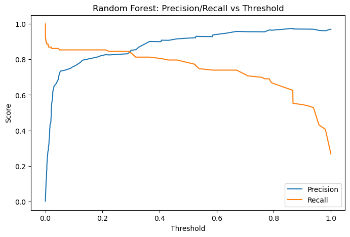

# 🛡️ Credit Card Fraud Detection — End-to-End Data Science Project

## 📖 Overview  
This project demonstrates how machine learning can be applied to detect fraudulent credit card transactions in a real-world banking scenario.  
Fraud detection is highly imbalanced: fraudulent transactions make up less than 0.2% of all data.  
The challenge is to **catch fraud while minimizing false alerts** that overwhelm analysts and disrupt legitimate customers.

---

## 🛠️ Methodology  

### Data  
- 284,807 anonymized transactions from [Kaggle: Credit Card Fraud Detection](https://www.kaggle.com/datasets/mlg-ulb/creditcardfraud).  
- Features `V1...V28` are PCA-transformed for confidentiality.  
- Added features `Time` and `Amount`.  

### Process  
1. **Data Wrangling & Preprocessing**  
   - Checked for nulls, validated schema.  
   - Scaled `Amount` and `Time`.  
   - Stratified train/validation split to preserve fraud ratio.  

2. **Modeling**  
   - Logistic Regression (baseline).  
   - Random Forest with calibrated probabilities.  
   - Logistic Regression with SMOTE (oversampling minority class).  

3. **Evaluation**  
   - Metrics: Precision, Recall, F1, PR-AUC, ROC-AUC.  
   - Focused on **precision/recall trade-offs** instead of accuracy.  
   - Threshold tuning to balance fraud detection with false alert reduction.  

4. **Interpretability**  
   - Logistic Regression coefficients (top predictive components).  
   - Random Forest feature importances.  
   - Business-friendly explanations of model signals.  

5. **Deployment Awareness**  
   - Saved trained models and scaler with `joblib`.  
   - Produced a comparison table for business decision-making.

## 📉 Precision–Recall Trade-off

The Random Forest model achieves a strong balance between **recall** (fraud caught) and **precision** (alerts that are correct).  
The chart below shows how precision increases as recall decreases when the decision threshold is adjusted.



---

## 📊 Results  

| Model @ point          | Threshold | Precision | Recall | F1    | ROC-AUC | PR-AUC |
|-------------------------|-----------|-----------|--------|-------|---------|--------|
| Logistic Regression     | 0.973     | 0.517     | 0.854  | 0.644 | 0.973   | 0.704  |
| Random Forest (best F1) | 0.365     | 0.901     | 0.813  | 0.855 | 0.970   | 0.836  |
| Random Forest (rec≥80%) | 0.406     | 0.908     | 0.805  | 0.853 | 0.970   | 0.836  |
| SMOTE + LogReg          | 1.000     | 0.844     | 0.789  | 0.815 | 0.972   | 0.711  |

**Key Insights:**  
- Logistic Regression: high recall (85%) but very noisy (52% precision).  
- Random Forest: best balance — ~81% recall with ~90% precision.  
- SMOTE + Logistic: better than baseline LR, but not as strong as Random Forest.  

**Business Takeaway:**  
A tuned Random Forest reduces false alerts by >90% while still catching >80% of fraud cases.  
This makes fraud alerts more trustworthy for analysts and reduces unnecessary customer disruptions.


---

## ⚙️ How to Run  

1. Download dataset from [Kaggle](https://www.kaggle.com/datasets/mlg-ulb/creditcardfraud).  
2. Place `creditcard.csv` in your working directory.  
3. Install requirements:  
   ```bash
   pip install -r requirements.txt
